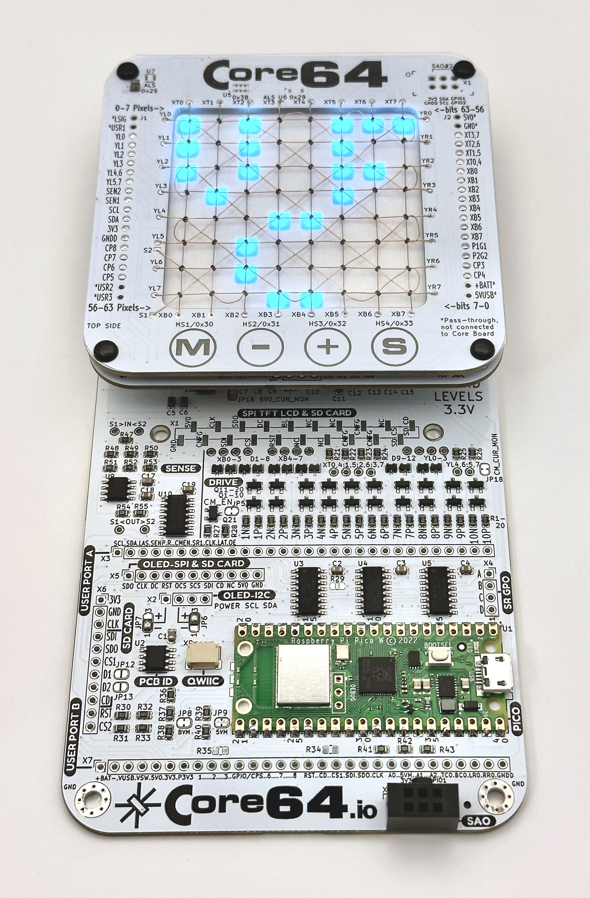
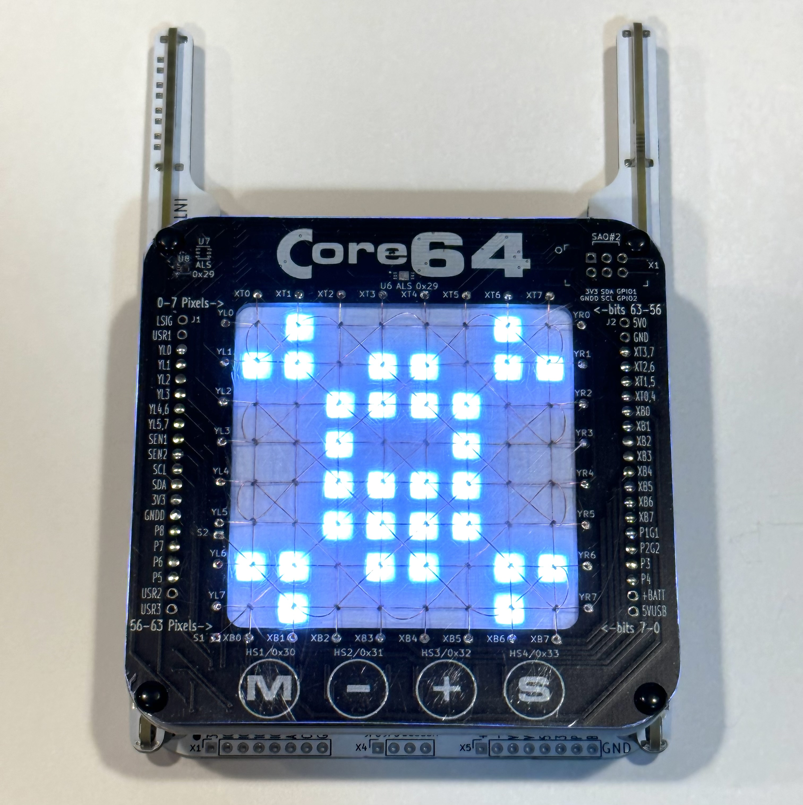
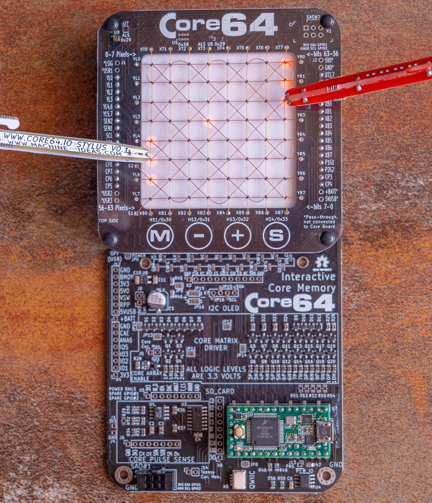
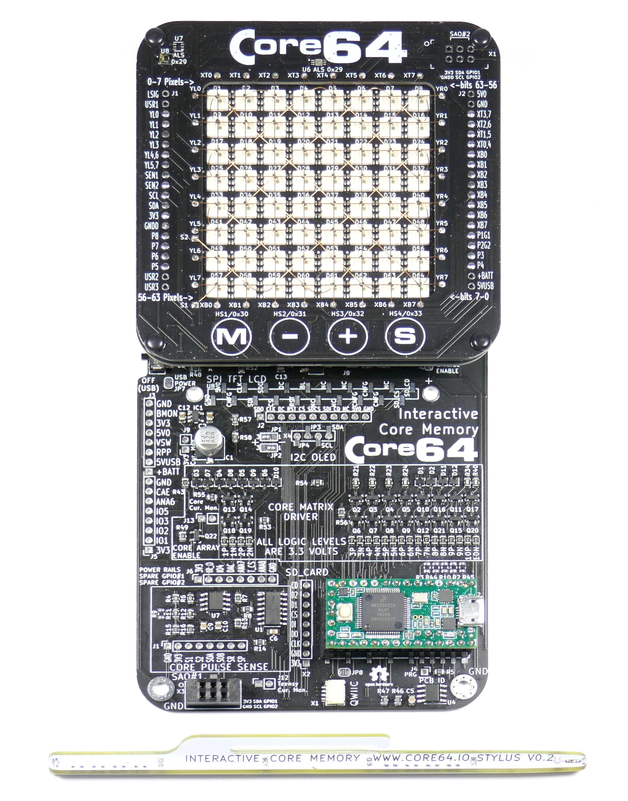

# Core64 and Core64c
Official Core64 and Core64c Interactive Core Memory Badge Kit Firmware and Documentation!

Weave your own 64 bits of core memory over the top of LEDs to interact with directly using a magnetic wand.

Purchase or get support: https://www.Core64.io

Follow this project's origin story at: https://hackaday.io/project/166155-core-64-interactive-core-memory-badge

This repository supports the Core64 and Core64c kits starting with the Beta Kit (Hardware Version 0.5.0).

See latest firmware release at https://github.com/ageppert/Core64/releases (pre-compiled firmware for Teensy 3.2 and Pico-based versions)

# Hardware Version History (latest on top)

Core64 V0.8 Pico-based Kit:

Core64c V0.4 Pico-based Kit:

Core64 V0.6 Pre-Production Teensy 3.2-based Kits. Associated Firmware Release https://github.com/ageppert/Core64/releases/tag/V0.6.3

Core64 V0.5 Beta Test Kits Teensy 3.2-based. Associated Firmware Release https://github.com/ageppert/Core64/releases/tag/V0.5-Beta-Kit-Release-Demo

